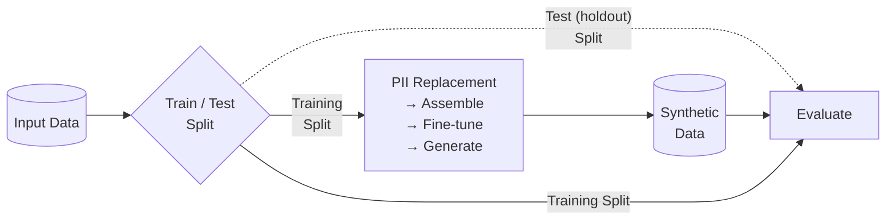

<!-- SPDX-FileCopyrightText: Copyright (c) 2025-2026 NVIDIA CORPORATION & AFFILIATES. All rights reserved. -->
<!-- SPDX-License-Identifier: Apache-2.0 -->

# Evaluation

Evaluation is a critical component of Safe Synthesizer that helps you understand both the utility and privacy of your synthetic data. The evaluation step is enabled by default and provides comprehensive reports comparing your input and synthetic datasets across multiple dimensions.

## How It Works

The pipeline splits your input data into two parts before any model training begins:

- Training data: the portion used for PII replacement, fine-tuning, and generation. This is the reference dataset for most evaluation metrics.
- Test (holdout) data: a small portion (5% by default) withheld from training entirely. Used by Membership Inference Protection and Text Semantic Similarity to detect memorization.

After generation, one new dataset is produced:

- Synthetic data: the records produced by the fine-tuned model during the generation step.



The evaluation system compares these datasets using two main frameworks:

1. Synthetic Quality Score (SQS): measures how well the synthetic data preserves statistical properties and utility
2. Data Privacy Score (DPS): assesses privacy protection and resistance to various attack vectors

We combine multiple metrics from each framework into an overall score.

## Synthetic Quality Score (SQS)

SQS is a measure of how well the synthetic data matches the training data. It is a score out of 10, where higher is better.

SQS comprises five metrics:

- Column Correlation Stability: analyzes correlations across every pair of columns
- Deep Structure Stability: uses Principal Component Analysis (PCA) to reduce dimensionality when comparing the training and synthetic data
- Column Distribution Stability: compares the distribution for each column in the training data to its counterpart in the synthetic data
- Text Structure Similarity: compares sentence, word, and character counts across the two datasets
- Text Semantic Similarity: determines whether the semantic meaning of the text is preserved after synthesis

The first three metrics apply to numeric and categorical columns; the last two apply to free-text columns. We calculate overall SQS as a weighted average of the five scores based on the number of numeric, categorical, and text columns. We show metrics with no applicable columns as N/A.

### Column Correlation Stability

We compute correlations for every numeric and categorical column pair in the training and synthetic data, then average the absolute differences. Lower average difference = higher score.

The report shows three heatmaps (training, synthetic, and their difference). The difference heatmap is most useful for interpreting results: lighter colors indicate closer correlation matching.

### Deep Structure Stability

We assess deep, multi-field structure by running joint Principal Component Analysis (PCA) on the training and synthetic data. PCA reduces dimensionality while capturing maximum variability of the dataset, yielding principal components that summarize the dataset's overall shape.

We compare the distributional distance between principal components from the training and synthetic data. The closer the principal components are, the higher the Deep Structure Stability score.

### Column Distribution Stability

This score measures how closely each synthetic column's value distribution matches the corresponding training column using Jensen-Shannon Distance. Lower average JS Distance across columns yields a higher score.

### Text Structure Similarity

This score measures how well synthetic free-text structure matches the training data by comparing average sentence, word, and character counts. Higher similarity indicates a better match.

### Text Semantic Similarity

We assess how well the semantic meaning of any synthetic free text matches that of the training data using cosine similarity of sentence embeddings. To penalize replaying of the training text, we hold out a 5% test set from the input data prior to training the model. We do not report Text Semantic Similarity when there is no test set or when sample sizes are too small.

## Data Privacy Score (DPS)

DPS analyzes the synthetic data to measure how well protected your training data is from adversarial attacks. It returns a score out of 10, where higher is better.

DPS includes three metrics:

- Membership Inference Protection: tests whether attackers can determine if specific records were in the training data
- Attribute Inference Protection: assesses whether sensitive attributes can be inferred from synthetic data
- PII Replay: evaluates the frequency with which sensitive values from the training data appear in the synthetic version

We average the first two to provide an overall DPS. We do not factor PII Replay into DPS; you should analyze it separately. Read more about these privacy metrics [here](https://arxiv.org/abs/2501.03941).

### Membership Inference Protection

This score measures resistance to membership inference attacks -- whether an attacker can tell if a specific record was in the training set. We simulate 360 attacks using a 5% holdout test set from the input data. The score reflects whether an attacker could infer membership above random chance by exploiting differences in the model's responses to training data versus unseen data. Low scores indicate potential memorization risk.

### Attribute Inference Protection

This score measures resistance to attribute inference attacks -- whether sensitive attributes can be predicted based on other attributes in the synthetic data. For a given attribute, a high score indicates that even when other attributes are known, the target attribute is difficult to predict.

### PII Replay

PII Replay counts the total and unique instances of personally identifiable information (PII) from your training data that show up in your synthetic data. Lower counts indicate higher privacy.

You should expect some PII replay, and it is often not a cause for concern. We typically see rarer entities (for example, full address, full name) replayed less frequently than common ones (for example, first name, U.S. state). To reduce replay, we recommend enabling [Replace PII](pii_replacement.md) before synthesis.

## Evaluation Reports

Every Safe Synthesizer job automatically generates an HTML evaluation report saved to `generate/evaluation_report.html` inside the run directory (by default `./safe-synthesizer-artifacts/<config>---<dataset>/<run_name>/`). A machine-readable companion file, `generate/evaluation_metrics.json`, contains the same scores and timing data as structured JSON. The report contains:

- Overall SQS and DPS scores
- Statistics describing the training and synthetic data
- Detailed subscores for each metric
- Visualizations comparing training and synthetic data

## Configuration

Evaluation is enabled by default but can be customized in your YAML config:

```yaml
evaluation:
  enabled: true       # Enable evaluation
  mia_enabled: true   # Membership Inference Attack
  aia_enabled: true   # Attribute Inference Attack
```

## Interpreting Scores

### SQS Interpretation

| Score Range | Rating | Guidance |
|-------------|--------|----------|
| **8.0-10.0** | Excellent | Production-ready utility; differences are negligible. Proceed to privacy review and standard validation. |
| **6.0-7.9** | Very Good | Usable for most analytics/ML with minor drift. Validate key KPIs/models; consider light tuning to close gaps. |
| **4.0-5.9** | Good | Noticeable utility gaps. Limit to exploratory analysis; increase training steps, adjust hyperparameters, or add data coverage; then re-evaluate. |
| **2.0-3.9** | Moderate | Significant quality loss. Do not use for decisions; fix preprocessing/schema typing, address class imbalance, increase model capacity, retrain, then re-evaluate. |
| **Below 2.0** | Poor | Fails utility bar. Block use; audit data quality and configuration, revise modeling approach, and re-run. |

### DPS Interpretation

| Score Range | Rating | Guidance |
|-------------|--------|----------|
| **8.0-10.0** | Excellent | Ready for external sharing; residual risk is very low. Proceed with utility review and standard governance. |
| **6.0-7.9** | Very Good | Low risk for most uses. Safe for internal sharing and many external partners; tighten handling for any high-sensitivity columns. |
| **4.0-5.9** | Good | Meaningful privacy risk present. Limit use to controlled internal analysis; strengthen PII replacement or enable DP (lower epsilon if already enabled), then re-evaluate. |
| **2.0-3.9** | Moderate | High leakage/memorization risk. Do not distribute; expand detection coverage, apply stronger transformations, and retune synthesis. |
| **Below 2.0** | Poor | Fails privacy bar. Block release; increase training data, fix detection gaps, or enable strong DP and re-run. |

## Related Topics

- [Synthetic Data Quality](../user-guide/evaluating-data.md): See recommendations for increasing quality and privacy scores
